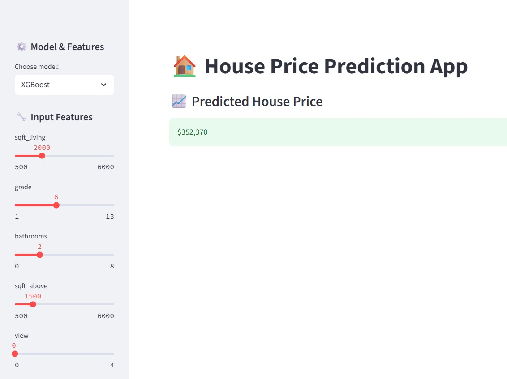

# 🏠 House Price Prediction

A complete machine learning project to predict house prices, built from scratch and deployed as an interactive web app with Streamlit.

[!House Price Prediction](https://housepricepredyction.streamlit.app/)
---

## ✅ App

## 🚀 **Features**
- Choose between Linear Regression and XGBoost models
- Interactive sidebar to input house features
- Predicts house prices instantly
- Clean, modular Python code ready for extension
---

## 📊 **Methodology**

✅ Data workflow includes:
- Data loading & cleaning  
- Exploratory Data Analysis (EDA) & visualization  
- Feature engineering (e.g., house age, renovation years, living ratio)  
- Model building & evaluation (Linear Regression & XGBoost)  
- Hyperparameter tuning with GridSearchCV   
- Interactive web deployment using Streamlit

  ## 📍 **Final Recommendation & Conclusion**

- Use advanced ensemble models like XGBoost for better accuracy and robustness
- Apply thoughtful feature engineering to capture real-world business factors
- Tune hyperparameters with GridSearchCV to avoid overfitting
- Deploy as an interactive app so stakeholders can explore predictions dynamically
---
